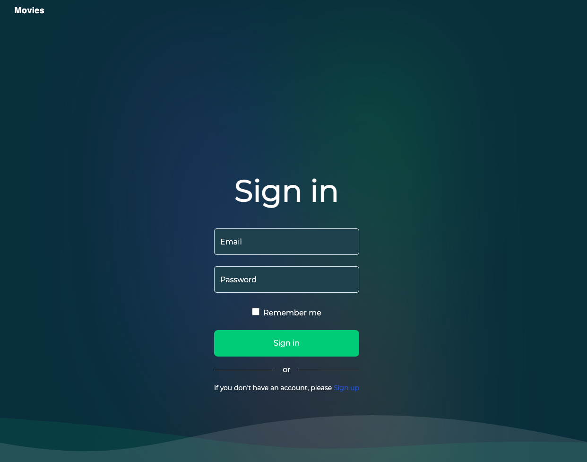
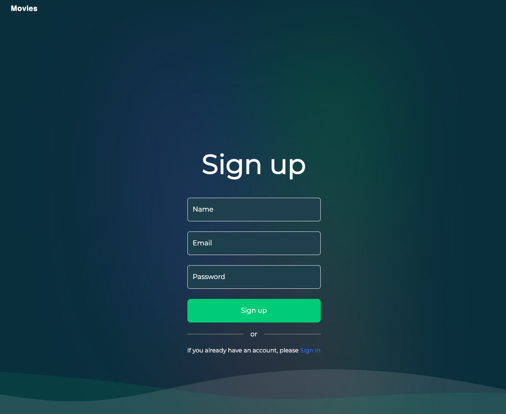
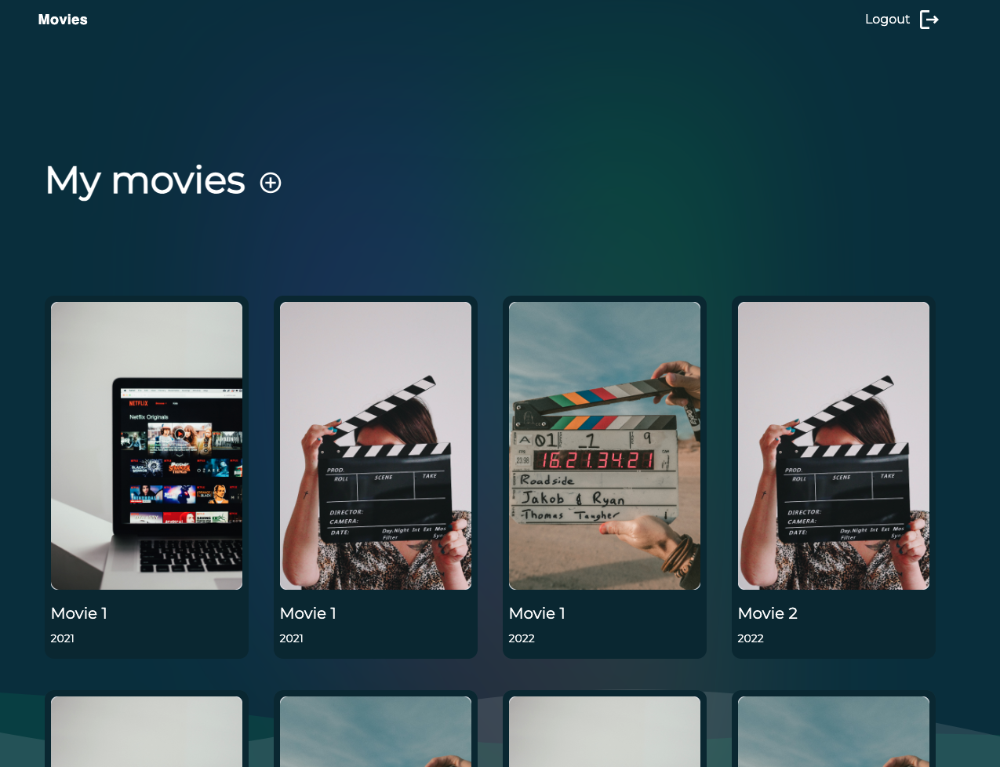
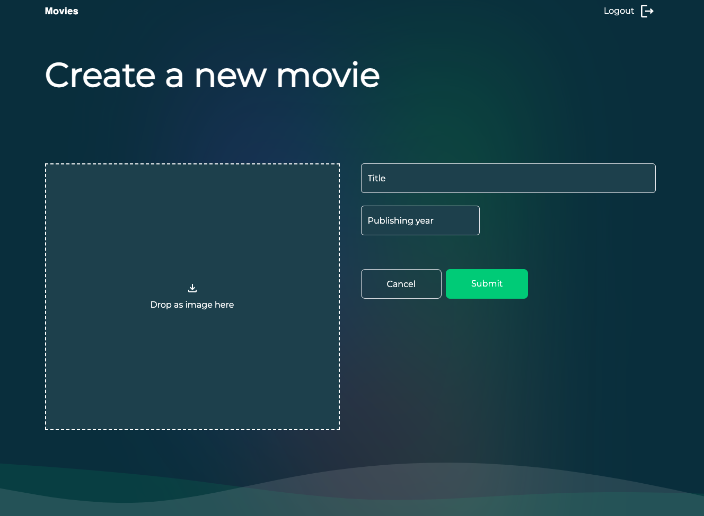
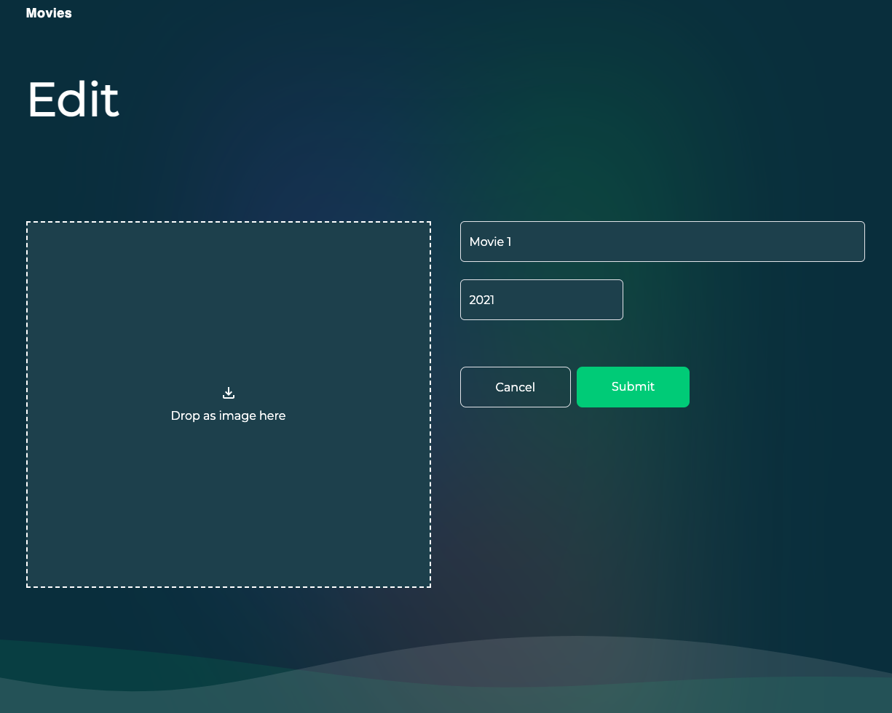

# Codeyani - Movie App - NextJS

Welcome to my Next.js project! This guide will help you set up and run the project locally.

## Prerequisites

- Node.js installed on your machine
- MongoDB database (you can use [MongoDB Atlas](https://www.mongodb.com/cloud/atlas) for a cloud-based solution)
- [NextAuth.js](https://next-auth.js.org/getting-started/introduction) setup for authentication

## Setup Instructions

### 1. Clone the Repository

```bash
git clone git@github.com:codeyani/movie-system-nextjs.git
cd your-repository
```

### 2.  Install Dependencies

Run the following command to install all the required dependencies:

```bash
npm install

```

### 3. Create a .env File

Create a .env file in the root directory of your project and add the following environment variables:

```bash
MONGODB_URI=
NEXTAUTH_SECRET=
```
- MONGODB_URI: This is the connection string for your MongoDB database. You can get this from your MongoDB provider (e.g., MongoDB Atlas).
- NEXTAUTH_SECRET: This is a secret key used by NextAuth.js for token encryption. You can generate a random string for this.

### 4. Set Up MongoDB

If you haven't already set up a MongoDB database, you'll need to create one. You can use [MongoDB Atlas](https://www.mongodb.com/products/platform/atlas-database) for a cloud-based solution. Once your database is set up, get the connection string and update the MONGODB_URI variable in your .env file.

### 5. Set Up NextAuth.js

For authentication, you'll need to set up NextAuth.js. Refer to the [NextAuth.js documentation](https://next-auth.js.org/getting-started/introduction) for detailed setup instructions. Make sure to update the NEXTAUTH_SECRET variable in your .env file with a strong, random string.

### 6. Run the Development Server
After setting up the environment variables, run the development server:

```bash
npm run dev
```

- try test account:

```bash
Username: user@example.com
Password: qwer1234
```

## Live Preview
You can check out a live preview of the application deployed on Vercel by visiting the following link:
[LIVE PREVIEW](https://movie-system-nextjs-eplhlofm7-codeyanis-projects.vercel.app/)

## Screenshot
Below is a screenshot of the application for reference:







## Contributing
Feel free to submit issues or pull requests if you have any suggestions or improvements.


